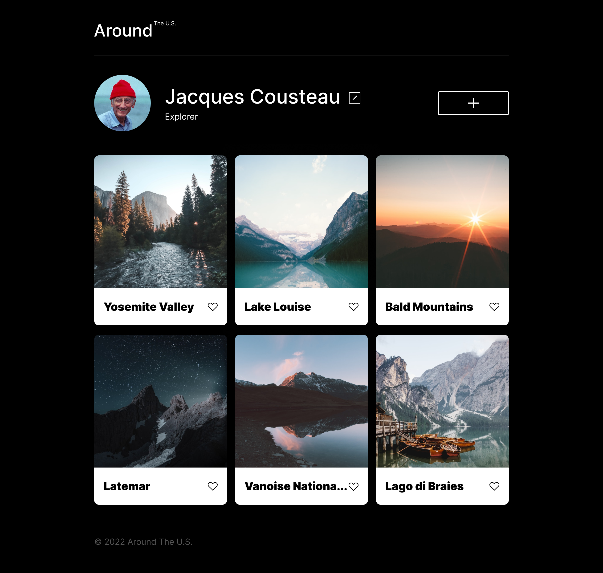
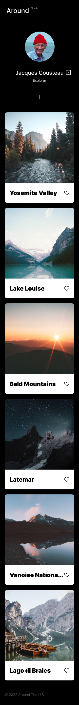

# Project 3: Around The U.S.

### Overview

- Intro
- Figma
- Images

**Intro**

Around the U.S project is an interactive site that allows users to build a profile, add and share experiences through images and like photos.
This project is made so all the elements are displayed correctly on popular screen sizes. Breakpoints for responsiveness were coded at 620px and 900px screen widths. HTML and CSS were created using this design brief via Figma.

**Links**

- [Link to the project on Figma](https://www.figma.com/file/ii4xxsJ0ghevUOcssTlHZv/Sprint-3%3A-Around-the-US?node-id=0%3A1)

- [Link to live site](https://dani98borges.github.io/se_project_aroundtheus/)

**Images**

